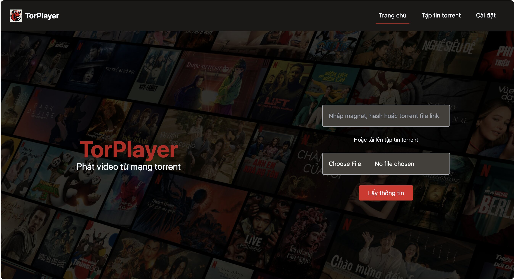
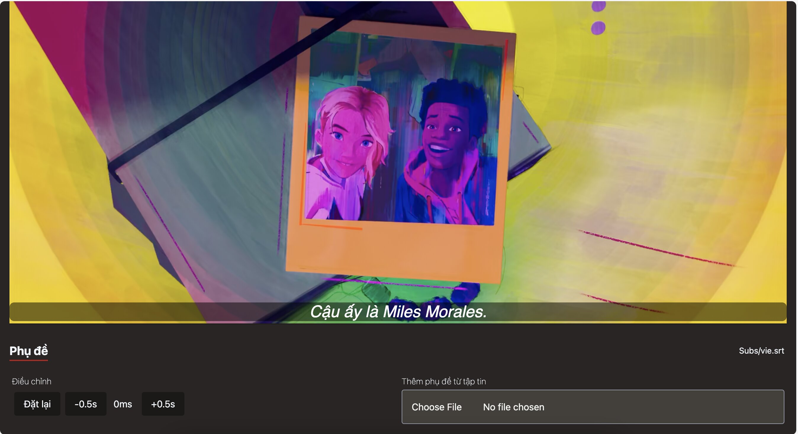

# TorPlayer

<div style="text-align:center"></div>

## Overview

TorPlayer is a cross-platform desktop application that allows users stream films from the torrent network.

## Table of Contents

- [Installation](#installation)
- [Features](#features)
- [Screenshots](#screenshots)

## Installation

```
TODO: Update late
```

## Features
- [x] Streaming mp4 files
- [x] Subtitles support
- [x] Open in VLC

## Screenshots



